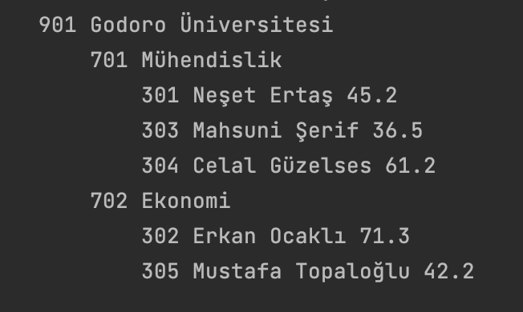
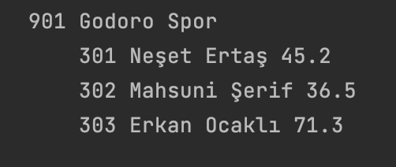
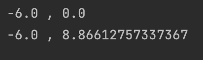
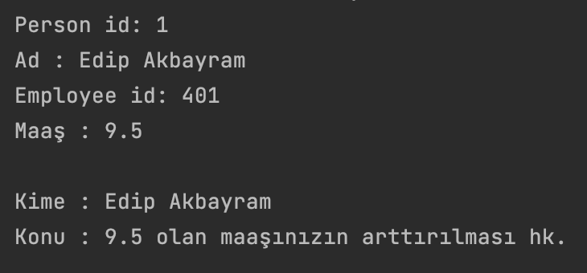
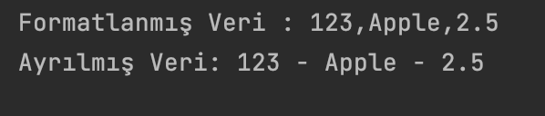
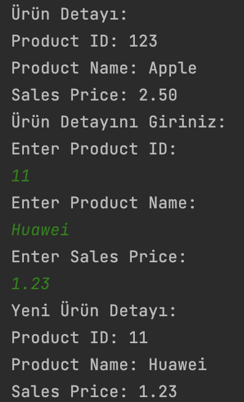
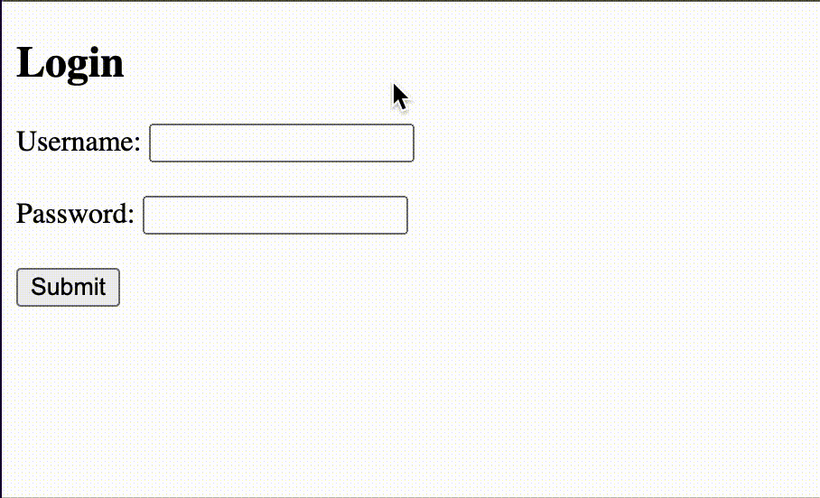

# MSJavaBootcamp

Bootcamp süresince yapılan ödevler ve bitirme projesini içerir.

## JAVA 01

### HOMEWORK 1

### HOMEWORK 2

## JAVA 02

### HOMEWORK 1

### HOMEWORK 2

## JAVA 03

### HOMEWORK 1

### HOMEWORK 2

## JAVA 04

# FINAL PROJECT

