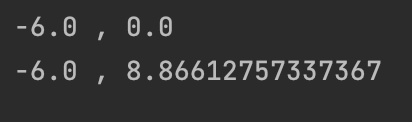
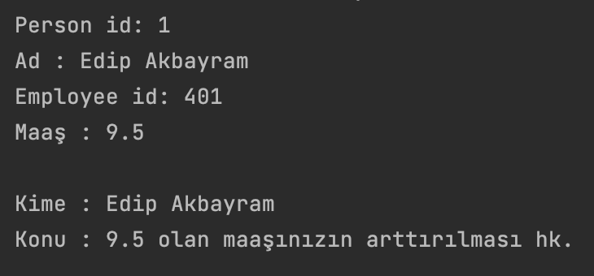

# MSJavaBootcamp

Bootcamp süresince yapılan çalışmalar ve ödevleri içerir. 

## JAVA 01

### HOMEWORK 1

### HOMEWORK 2

## JAVA 02

### HOMEWORK 1

### HOMEWORK 2

## JAVA 03

### HOMEWORK 1

<src/Java03/godoro/hw1/homework.png" width="auto">

### HOMEWORK 2

